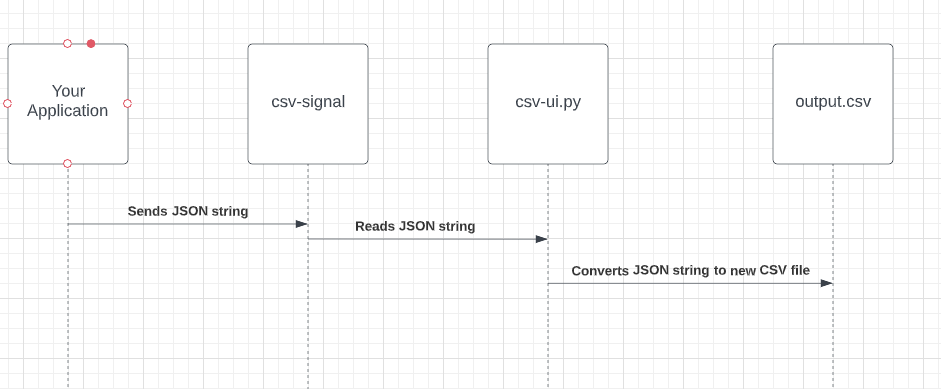

csv-microservice README

Setup
1. User must first download and place the csv-ui.py file into the root directory.
2. User must also download and place the csv-signal.txt into the root directory.
3. Ensure that the module Pandas can be imported with the current version of Python.  It is recommended to use the latest version 3.7 or higher.s
4. To start the csv-ui.py server, run the csv-ui.py file by typing python3 csv-ui.py in your terminal and press enter.  At this point, the server will be live and waiting for a request.
HOW TO REQUEST
6. To submit a REQUEST, the user must write a JSON string object into csv-signal.txt.  
HOW TO RECEIVE
6. csv-ui.py server will be listening for a JSON string object in csv-signal.txt.  Once detected, the csv-ui.py server will convert the JSON string object read from the csv-signal.txt file to CSV format and output this into a file titled outputfile.csv in the root directory.
